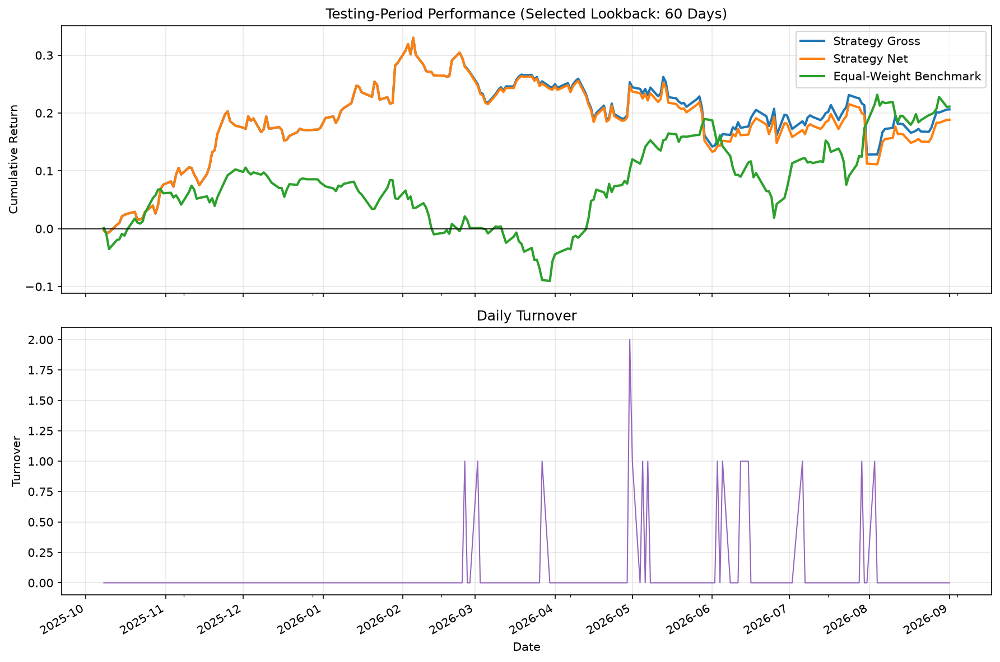

# Cross-Sectional Equity Momentum Backtest

A Python backtest of cross-sectional equity momentum using GOOGL, AAPL, and MSFT.

## Objective

This project uses Python, NumPy, pandas, and Matplotlib to implement a small-scale equity momentum backtest. It covers signal calculation, cross-sectional ranking, portfolio construction, transaction costs, and training/test evaluation.

The goal is to learn and implement a quantitative research workflow. This educational prototype does not establish that the strategy will be profitable in live trading.

## Data

- **Stocks:** GOOGL, AAPL, MSFT.
- **Data frequency:** Daily, with 752 shared trading dates.
- **Date range:** 2023-09-01 to 2026-09-01.
- **Data source:** Nasdaq historical stock price data.
- **Price input:** Daily closing prices from the `Close/Last` field.
- **Return calculation:** Close-to-close price changes. No separate dividend cash flows are added.
- **Input file:** [data/prices_3y.csv](data/prices_3y.csv), with a `Date` column and one price column per stock.

The current CSV has no missing prices or duplicate dates. The file does not retain corporate-action adjustment metadata, so it should not be described as a verified total-return dataset.

## Methodology

### Signal and portfolio construction

For each stock, momentum is the price change over a lookback window of `N` trading days:

```text
momentum[i, t] = price[i, t] / price[i, t - N] - 1
```

Stocks are ranked daily in descending order of momentum. The intended target weights are:

- Long the highest-momentum stock with a weight of `+0.5`.
- Short the lowest-momentum stock with a weight of `-0.5`.
- Assign a weight of `0` to the remaining stock.

With complete signals and unique ranks, this gives **net exposure of 0** and **gross exposure of 1**. Equal long and short dollar exposures do not eliminate risk. The current handling of tied ranks is described under Limitations.

### Portfolio returns and trading costs

Target weights are shifted by one trading day and multiplied by daily close-to-close stock returns. For applied weights `w` and stock returns `r`:

```text
gross_return[t] = sum_i(w[i, t] * r[i, t])
turnover[t] = sum_i(abs(w[i, t] - w[i, t - 1]))
transaction_cost[t] = turnover[t] * cost_bps / 10000
net_return[t] = gross_return[t] - transaction_cost[t]
```

Turnover uses the full sum of absolute weight changes, without dividing by two. A cost assumption of 10 basis points (bps) means 0.10% per unit of traded notional.

This is a simplified daily-weight model, not a simulation of next-day opening-price execution.

### Benchmark and performance metrics

The benchmark is a daily-rebalanced, equal-weight long-only portfolio of the same three stocks. Its daily return is the mean of their daily returns, with no transaction costs deducted. It is not an initial equal-weight buy-and-hold portfolio.

Performance metrics use 252 trading days per year:

- **Total return:** The compounded return over the evaluation period.
- **Annualized return:** Mean daily return multiplied by 252. This is an arithmetic annualized return, not CAGR.
- **Annualized volatility:** Sample standard deviation of daily returns multiplied by the square root of 252.
- **Sharpe ratio:** Annualized mean return divided by annualized volatility, assuming a zero risk-free rate.
- **Maximum drawdown:** The largest peak-to-trough decline in compounded wealth, including initial wealth of 1 as a possible peak. The code reports it as a negative value.
- **Average daily turnover:** The mean of the daily turnover estimates.

## Train/Test Design

The candidate lookback windows are **20, 60, 120, and 252 trading days**.

1. Split the original 752 observations chronologically into the first 526 observations for training and the remaining 226 for testing.
2. Use a common evaluation start date after the 252-day lookback and one-day weight lag. The first 253 observations are excluded from the common performance comparison.
3. At a transaction-cost assumption of 10 bps, select the lookback with the highest training-period Sharpe ratio.
4. Keep that lookback fixed when evaluating the testing period.
5. Compare testing-period results at 0, 5, 10, and 20 bps to assess cost sensitivity, without reselecting the lookback.

The effective performance windows are:

| Period | Start date | End date | Observations |
| --- | --- | --- | ---: |
| Training | 2024-09-05 | 2025-10-07 | 273 |
| Testing | 2025-10-08 | 2026-09-01 | 226 |

The original split is approximately 70:30, but the effective performance sample is not, because the warm-up observations are excluded from training.

The backtest is calculated over the full price history before the evaluation periods are extracted. Testing therefore retains earlier signal history and the existing portfolio state rather than starting a new portfolio from cash. The code selects the lookback from the training summary, not the full-sample or testing results.

## Results

The training-period selection identifies a **60-trading-day lookback**. Under a **10 bps transaction-cost assumption**, its testing-period results are:

| Metric | Testing result |
| --- | ---: |
| Total return | 18.84% |
| Arithmetic annualized return | 21.27% |
| Annualized volatility | 20.07% |
| Sharpe ratio | 1.0597 |
| Maximum drawdown | -16.45% |
| Average daily turnover | 6.64% |

The maximum drawdown represents a 16.45% decline from a previous wealth peak. Average daily turnover is a weight-change measure, not a daily return.

### Transaction-cost sensitivity

The same selected lookback is used in every scenario:

| Cost assumption | Testing-period total return |
| --- | ---: |
| 0 bps | 20.63% |
| 5 bps | 19.73% |
| 10 bps | 18.84% |
| 20 bps | 17.08% |

Increasing the cost assumption from 0 to 20 bps reduces the total return by approximately **3.6 percentage points**. Trading costs reduce ending wealth even though the underlying signals and positions remain unchanged. These scenarios illustrate sensitivity to the assumed cost, rather than estimating actual execution costs.

The cost-free equal-weight benchmark returns **21.11%** over the same testing dates, compared with **18.84%** for the strategy after 10 bps costs. This is a descriptive comparison: the benchmark is fully long, while the strategy targets zero net dollar exposure, and their risk and cost assumptions differ.



The reported figures correspond to the saved [testing summary](results/day5_3y_test_summary.csv), [cost summary](results/day5_3y_cost_summary.csv), and [daily backtest results](results/day5_3y_backtest_results.csv). They describe this dataset and implementation, not expected future returns.

## Limitations

- **Small, selected stock universe:** The sample contains only three large technology stocks. This concentration and selection bias limit the generality of the findings.
- **Simplified execution timing:** Applying a signal to the next close-to-close return implicitly assumes a fill at the close used to calculate that signal. Such a fill may not be achievable after the closing price is known. Shifting weights alone does not establish a fully look-ahead-free execution model.
- **Approximate turnover:** Costs are based on changes in applied weights. The model does not track the rebalancing trades needed to offset weight drift caused by price changes, so it may understate trading costs.
- **Omitted cash flows and frictions:** Dividend cash flows, stock-borrow fees, financing costs, and slippage are not explicitly modeled. Corporate-action adjustments are not documented in the CSV.
- **Unresolved tie and flat-day handling:** The saved code currently uses pandas' default average ranks, not a fixed-order tie-break. No ties occur on valid signal dates in this dataset for the four tested lookbacks, but ties in another dataset can violate the intended exposure constraints. The code also removes zero-position dates, which would need revision to retain genuine cash periods and any exit costs.
- **Limited validation:** One chronological training/test split and four lookback windows do not establish robustness across different stock universes or market regimes.

## How to Run

Python 3 is required. On macOS or Linux, open a terminal in the repository root. For a new local environment:

```bash
python3 -m venv .venv
source .venv/bin/activate
python -m pip install -r requirements.txt
python momentum_backtest.py
```

If this repository already has a working virtual environment, skip the creation step. For later runs, activate that environment and run the script.

The script reads the included [price data](data/prices_3y.csv) and saves its outputs in [results](results/):

- Daily strategy returns, turnover, transaction costs, and benchmark returns.
- Full-sample, training, and testing performance summaries.
- A transaction-cost sensitivity summary.
- A training/testing comparison.
- The cumulative-return and turnover chart shown above.

Running the script overwrites the corresponding `day5_3y_` output files. The older `day4_` files are retained and are not regenerated by this script. The chart is saved to disk rather than displayed in an interactive window.

Dependency versions in `requirements.txt` are currently unpinned, so identical behavior across future package versions is not guaranteed.
